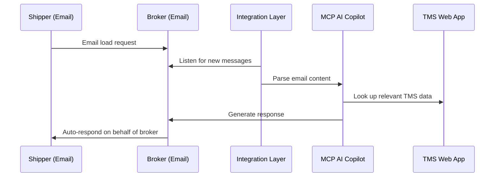
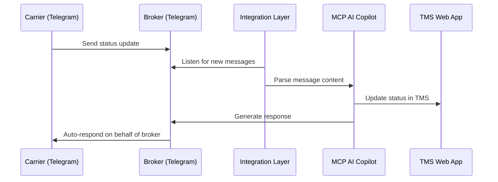

# 3PL Copilot

When you'll start testing the web app, let us know. We will update the token for email sender. 
It expires too fast, due to the GCP app being in test mode.


## Demo

[Link](https://www.loom.com/share/3997d14b5b8145f59814e26320915ce3?sid=cc4a44c3-a75f-43d0-b3f5-7f184503f3fc) to the demo. Or you can download [file](3pl_copilot_demo.mp4) from git.

## Essentials

Demo page: http://plcopilot.xyz

Telegram bot: https://t.me/testing_threepl_copilot_bot and phone number for Carrier: +485382535268

Email through which you can login to the admin page

```
email: 3plcopilot@gmail.com
password: 0cf/54Fd~$D<
```

Email on which you can get response when updating ETA through courier

```
email: shipper.3plcopilot@gmail.com
password: ?0Po52Nj1)i-
```

## Presentation

Pitch deck can be found [here](presentation.pdf)


## History

Project was created entirely from scratch during the hackathon.

What was developed:

1. Admin page through which user can connect email (only emails added to the Google Cloud Platform as test users due to app being in test mode), TMS and change the name of the telegram bot.
2. MCP server which can get and update data in the TMS.
3. Telegram bot which can recieve messages from couriers and ask MCP server to update the data in the TMS.
4. Gmail client which can recieves emails from the users and answer their questions about the shipments.

## Use cases

### Shipper asks broker about shipment status


**How to test step-by-step**
1. Sign into gmail account
```
Broker
email: 3plcopilot@gmail.com
password: <reach-out-for-password>
```
2. Navigate to http://plcopilot.xyz
3. Sign in with **Broker** email
4. Click "Connect" TMS and Telegram
5. Sign into gmail account
```
Shipper
email: shipper.3plcopilot@gmail.com
password: <reach-out-for-password>
```
6. Send message from shipper.3plcopilot@gmail.com to 3plcopilot@gmail.com with question like "Where's my shipment?"

### Carrier updates the shipment status 


**How to test step-by-step**
1. Sign into telegram account
2. Navigate to https://t.me/3pl_copilot_bot
3. Click "Start"
4. Provide phone number including '+' symbol: +485382535268
5. Send one of the following messages
- "I'll be late for another 2 hours for #{shipment_id}. Update ETA" -> It'll update ETA
- "Update Shipper" - It'll return shipments 
## Local installation

1. Clone the repository

```
git clone --recurse-submodules https://github.com/Ogon-AI/3pl-copilot.git
```

2. Create a virtual environment

```
python -m venv venv && source venv/bin/activate
```

3. Install dependencies

```
pip install -r requirements.txt
```

4. Create .env file


```
OPENAI_API_KEY=<your_openai_api_key>
DB_PATH=sqlite:///database/test_shipments.db
ANTHROPIC_API_KEY=<your_anthropic_api_key>
TELEGRAM_BOT_TOKEN=<your_telegram_bot_token>
```

5. Create [credentials](https://developers.google.com/workspace/gmail/api/quickstart/python) for the Google Cloud Platform


6. Run the application

```
chmod +x run_all.sh
./run_all.sh
```
